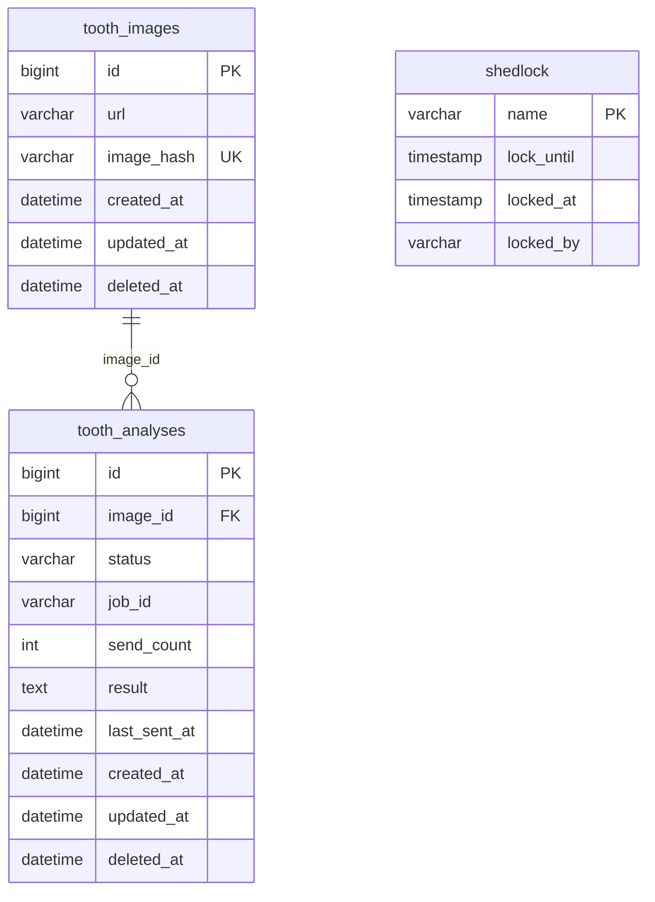

# Realteeth — 치아 이미지 AI 분석 서비스

Spring Boot 3.5.11 + Kotlin + WebFlux + R2DBC 기반의 치아 이미지 비동기 AI 분석 서버입니다.

---

## 목차

### 시작하기
1. [실행 방법](#실행-방법)
2. [API 명세](#api-명세)

### 설계 및 기술선택
3. [기술선택 이유](#기술선택-이유)
4. [패키지 구조](#패키지-구조)
5. [ERD](#erd)
6. [상태 모델 설계 의도](#상태-모델-설계-의도)
7. [상태 전이 흐름](#상태-전이-흐름)
8. [외부 시스템 연동 방식 및 선택 이유](#외부-시스템-연동-방식-및-선택-이유)

### 신뢰성
9. [처리 보장 모델](#처리-보장-모델)
10. [서킷 브레이커](#서킷-브레이커)
11. [중복 요청 처리](#중복-요청-처리)

### 운영
12. [서버 재시작 시 동작 및 정합성 분석](#서버-재시작-시-동작-및-정합성-분석)
13. [트래픽 증가 시 병목 가능 지점](#트래픽-증가-시-병목-가능-지점)

---

## 실행 방법

### 사전 요구사항

- Docker / Docker Compose
- JDK 21 (로컬 실행 시)

### 환경변수

| 변수명 | 기본값 | 설명 |
|---|---|---|
| `SPRING_R2DBC_URL` | `r2dbc:mysql://localhost:3306/realteeth` | R2DBC DB 접속 URL |
| `SPRING_R2DBC_USERNAME` | `root` | DB 사용자명 |
| `SPRING_R2DBC_PASSWORD` | `1234` | DB 비밀번호 |
| `CLIENT_TOOTH_ANALYSIS_API_KEY` | **(필수)** | Mock Worker API 키 |

`CLIENT_TOOTH_ANALYSIS_API_KEY`는 기본값이 없으므로 실행 전 반드시 주입해야 합니다. 나머지 변수는 `docker-compose.yml`에 기본값이 설정되어 있습니다.

### 방법 A: 전체 컨테이너 실행 (MySQL + App)

Docker만 있으면 JDK 없이도 실행할 수 있습니다.

```bash
CLIENT_TOOTH_ANALYSIS_API_KEY=<발급받은_키> docker-compose up --build
```

또는 `.env` 파일을 사용할 수 있습니다.

```bash
# .env 파일 생성
echo "CLIENT_TOOTH_ANALYSIS_API_KEY=<발급받은_키>" > .env

# 실행 (docker-compose가 .env를 자동으로 읽음)
docker-compose up --build
```

### 방법 B: 로컬 실행 (MySQL만 컨테이너, 앱은 로컬)

```bash
# MySQL 컨테이너 실행
docker-compose up -d mysql

# 애플리케이션 실행 (JDK 21 필요)
CLIENT_TOOTH_ANALYSIS_API_KEY=<발급받은_키> ./gradlew bootRun

# JDK 21이 기본값이 아닌 경우 (macOS)
CLIENT_TOOTH_ANALYSIS_API_KEY=<발급받은_키> JAVA_HOME=$(/usr/libexec/java_home -v 21) ./gradlew bootRun
```

| 항목 | 값 |
|---|---|
| 서버 포트 | `8080` |
| Swagger UI | http://localhost:8080/docs |
| OpenAPI JSON | http://localhost:8080/v3/api-docs |

### 테스트 실행

```bash
JAVA_HOME=$(/usr/libexec/java_home -v 21) ./gradlew test
```

> 테스트는 Testcontainers를 통해 MySQL을 자동으로 실행합니다. Docker가 실행 중이어야 합니다.

---

## API 명세

전체 API 문서는 서버 실행 후 **Swagger UI**(http://localhost:8080/docs)에서 확인할 수 있습니다.

### 공통 응답 형식

```json
// 성공
{ "success": true, "data": { ... }, "error": null }

// 실패
{ "success": false, "data": null, "error": { "code": "...", "message": "...", "details": [...] } }
```

### 엔드포인트 요약

| 메서드 | 경로 | 설명 |
|---|---|---|
| `POST` | `/api/v1/tooth-analyses` | 치아 이미지 분석 요청 |
| `GET` | `/api/v1/tooth-analyses/{id}/stream` | 분석 상태 실시간 스트리밍 (SSE) |
| `GET` | `/api/v1/tooth-analyses/{id}` | 분석 단건 조회 |
| `GET` | `/api/v1/tooth-analyses` | 분석 목록 조회 (페이지네이션) |

### POST /api/v1/tooth-analyses

치아 이미지 분석을 요청합니다. 요청은 즉시 수락되고, 실제 분석은 비동기로 처리됩니다.

**요청 바디**
```json
{ "imageUrl": "https://example.com/tooth.jpg" }
```

**응답 (200)**
```json
{
  "success": true,
  "data": {
    "toothAnalysisId": 1,
    "toothAnalysisStatus": "PENDING"
  }
}
```

### GET /api/v1/tooth-analyses/{id}/stream

Server-Sent Events(SSE)로 분석 상태 변경을 실시간으로 수신합니다.
상태가 `COMPLETED` 또는 `FAILED`가 되면 스트림이 자동 종료됩니다.

**응답 (text/event-stream)**
```
data: {"success":true,"data":{"toothAnalysisId":1,"toothAnalysisStatus":"PENDING",...}}

data: {"success":true,"data":{"toothAnalysisId":1,"toothAnalysisStatus":"PROCESSING",...}}

data: {"success":true,"data":{"toothAnalysisId":1,"toothAnalysisStatus":"COMPLETED","result":"정상",...}}
```

> 상태가 변경될 때만 이벤트가 발행됩니다. 2초 간격으로 DB를 폴링합니다.

### GET /api/v1/tooth-analyses/{id}

분석 작업의 현재 상태와 결과를 조회합니다.

### GET /api/v1/tooth-analyses

분석 목록을 페이지네이션하여 조회합니다.

| 쿼리 파라미터 | 타입 | 기본값 | 설명 |
|---|---|---|---|
| `from` | LocalDate | to 기준 6개월 전 | 조회 시작일 |
| `to` | LocalDate | 오늘 | 조회 종료일 |
| `status` | enum | (없음) | 상태 필터 |
| `page` | int | 0 | 페이지 번호 |
| `size` | int | 20 | 페이지 크기 (최대 100) |

> 날짜 범위는 최대 6개월까지만 허용됩니다.

---

## 기술선택 이유

### Spring WebFlux + Kotlin Coroutine + R2DBC

본 서비스는 **IO 집약적** 애플리케이션입니다. 요청 처리 흐름의 대부분이 DB 쿼리, 외부 AI API 호출, SSE 스트리밍 대기로 구성되며 CPU 연산 비중은 매우 낮습니다.

전통적인 Spring MVC(스레드-퍼-요청) 모델에서는 IO 대기 중에도 스레드가 블로킹됩니다. 동시 요청이 늘어나면 스레드 풀이 포화되어 처리량이 제한됩니다.

WebFlux + R2DBC의 비동기 논블로킹 스택을 사용하면 소수의 스레드로 다수의 IO 대기 요청을 동시에 처리할 수 있습니다. Kotlin Coroutine을 적용하면 Flux/Mono 체인 없이 `suspend` 함수로 동일한 비동기 효과를 달성하여 코드 가독성을 유지합니다.

### ShedLock

스케줄러(`PendingAnalysisScheduler`, `ProcessingAnalysisScheduler`)는 DB 상태를 읽어 외부 API를 호출하는 구조입니다. 다중 인스턴스 환경에서 스케줄러가 동시에 실행되면 동일한 레코드에 대해 중복 API 호출이 발생합니다.

ShedLock은 스케줄러 실행 시 DB(shedlock 테이블)에 락을 획득하고, 락을 가진 단 하나의 인스턴스만 실행되도록 보장합니다. Redis 같은 별도 인프라 없이 이미 사용 중인 MySQL로 분산 락을 구현할 수 있어 운영 복잡도를 낮춥니다.

### DB 기반 At-Least-Once (Outbox 유사 패턴)

클라이언트 요청이 들어오면 **먼저 DB에 `PENDING` 상태로 저장**하고, 실제 외부 API 전송은 스케줄러가 담당합니다. HTTP 트랜잭션과 외부 API 호출을 분리하는 이 구조는 Outbox 패턴의 핵심 원리와 동일합니다.

이 방식의 핵심 이점은 **서버 재시작·장애 복구**입니다. 모든 미처리 작업이 DB에 남아 있으므로 서버가 재시작되어도 스케줄러가 자동으로 `PENDING`/`PROCESSING` 레코드를 이어서 처리합니다. 메모리 기반 큐를 사용했다면 프로세스 종료 시 미처리 작업이 모두 유실됩니다.

결과적으로 **At-Least-Once** (최소 1회 처리 보장)를 달성합니다. Exactly-Once는 Mock Worker와의 분산 트랜잭션(2PC) 없이는 구현이 불가능하므로, `max-send-count` 제한과 Graceful Shutdown으로 중복 전송을 완화합니다.

### Resilience4j 서킷 브레이커

GPU 추론 기반 외부 API는 응답 시간이 수 초~수십 초로 변동되고, 장애 발생 시 응답이 없거나 오류율이 급증합니다. 서킷 브레이커 없이 이 상황에서 스케줄러가 계속 호출을 시도하면 커넥션·스레드 자원이 고갈됩니다.

Resilience4j는 최근 5회 호출 중 60% 이상 실패하면 서킷을 OPEN하여 외부 API 호출을 즉시 차단합니다. 30초 후 HALF_OPEN 상태로 자동 전환되어 1회 프로브 요청으로 회복 여부를 확인합니다. 클라이언트 오류(400, 422)는 외부 시스템 장애가 아니므로 실패 카운트에서 제외하여 불필요한 서킷 오픈을 방지합니다.

### 폴링(Polling) 방식 채택

Mock Worker로부터 분석 완료 결과를 수신하는 방법은 두 가지입니다:
- **Webhook**: Mock Worker가 완료 시 서버로 콜백을 전송
- **Polling**: 서버가 주기적으로 Mock Worker에 상태를 조회

Mock Worker가 콜백 기능을 제공하지 않으므로 폴링이 유일한 선택지입니다. 폴링은 서버가 주도권을 가지고 재시도·장애 처리를 직접 제어할 수 있어, 콜백 수신 실패 등 Webhook 고유의 장애 시나리오가 없다는 장점도 있습니다.

### Graceful Shutdown (35초)

비동기 논블로킹 환경에서는 서버가 강제 종료되면 진행 중인 코루틴(DB 저장 트랜잭션 등)이 중단됩니다. 이 경우 외부 API 호출은 성공했지만 DB 저장이 실패하여 상태 불일치가 발생합니다(처리 보장 모델의 지점 1).

`server.shutdown: graceful`과 `timeout-per-shutdown-phase: 35s` 설정으로, 정상 종료 신호(SIGTERM) 수신 시 진행 중인 요청 처리를 완료한 뒤 프로세스가 종료됩니다. 35초는 ShedLock의 `lock-at-most-for`(30초)보다 길게 설정하여 락을 보유한 스케줄러 사이클이 완료될 충분한 여유를 확보합니다.

---

## 패키지 구조

CQRS 패턴을 기반으로 쓰기(Command)와 읽기(Query)를 분리합니다. Command 측은 DDD 원칙을 엄격히 적용하고, Query 측은 성능 우선으로 규칙을 완화합니다.

```
com.mock.realteeth
├── command/                         # 쓰기 (DDD 원칙 엄격 적용)
│   ├── domain/                      # 순수 도메인 — Spring 의존 없음
│   │   ├── ToothAnalysis.kt         # 핵심 엔티티
│   │   ├── ToothAnalysisStatus.kt   # 상태 열거형
│   │   ├── ToothImage.kt
│   │   ├── ToothAnalysisRepository.kt   # 인터페이스 (infra가 구현)
│   │   ├── ToothImageRepository.kt
│   │   ├── ToothAnalysisClient.kt       # 외부 API 인터페이스 (infra가 구현)
│   │   ├── LockManager.kt
│   │   ├── BaseEntity.kt
│   │   └── exception/               # ErrorCode, BusinessException
│   └── application/                 # 유스케이스 오케스트레이션
│       ├── ToothAnalysisService.kt
│       └── dto/                     # AnalyzeToothCommand, AnalyzeToothResult
│
├── query/                           # 읽기 (성능 우선, 레이어 규칙 완화)
│   ├── application/
│   │   └── ToothAnalysisQueryService.kt
│   ├── dao/
│   │   └── ToothAnalysisQueryRepository.kt
│   └── dto/                         # *Query, *Result, projection 타입
│
├── ui/                              # HTTP 진입점
│   ├── ToothAnalysisController.kt
│   ├── HealthCheckController.kt
│   ├── GlobalExceptionHandler.kt
│   └── dto/                         # *Request, *Response, ApiResponse
│
└── infra/                           # 인프라 어댑터
    ├── client/                      # ToothAnalysisClientImpl (외부 AI API)
    ├── config/                      # R2DBC, WebClient, Resilience, Scheduler 등
    ├── lock/                        # MySqlLockManager
    └── scheduler/                   # PendingAnalysisScheduler, ProcessingAnalysisScheduler
```

### 의존성 방향

**Command (쓰기)** — 엄격한 DIP 적용:
```
ui → command.application → command.domain ← infra
```
`command.domain`은 Spring·인프라에 무의존. `infra`가 domain 인터페이스를 구현합니다.

**Query (읽기)** — 성능 우선으로 규칙 완화:
- `query.application`과 `query.dao`는 `command.domain` 타입(`ToothAnalysisStatus`, `ErrorCode` 등)을 직접 참조할 수 있습니다.

---

## ERD



### 컬럼 설명

| 테이블 | 컬럼 | 설명 |
|---|---|---|
| `tooth_images` | `image_hash` | 이미지 URL의 MD5 해시. UNIQUE 제약으로 동일 이미지 중복 저장 방지 |
| `tooth_analyses` | `status` | `PENDING` / `PROCESSING` / `COMPLETED` / `FAILED` |
| `tooth_analyses` | `job_id` | Mock Worker가 발급한 분석 작업 ID. PROCESSING 전환 시 저장 |
| `tooth_analyses` | `send_count` | Mock Worker에 요청을 보낸 횟수. 최대 5회 초과 시 FAILED 전환 |
| `tooth_analyses` | `last_sent_at` | 마지막으로 요청을 보낸 시각. 스케줄러 정렬 기준 |
| `shedlock` | `lock_until` | 락 만료 시각. 강제 종료 시에도 이 시각 이후 자동 해제 |

### 인덱스

| 인덱스 | 테이블 | 컬럼 | 목적 |
|---|---|---|---|
| `uk_tooth_images_image_hash` | `tooth_images` | `(image_hash)` | 동일 이미지 중복 저장 방지 (UNIQUE) |
| `idx_tooth_analyses_status_last_sent_at` | `tooth_analyses` | `(status, last_sent_at)` | PendingAnalysisScheduler / ProcessingAnalysisScheduler 조회 최적화 |
| `idx_tooth_analyses_created_at` | `tooth_analyses` | `(created_at)` | 목록 조회 날짜 범위 필터 |
| `idx_tooth_analyses_status_created_at` | `tooth_analyses` | `(status, created_at)` | 상태 + 날짜 복합 필터 조회 최적화 |

---

## 상태 모델 설계 의도

### 상태 정의

| 상태 | 의미 |
|---|---|
| `PENDING` | 분석 요청이 접수되어 Mock Worker로의 전송을 대기 중 |
| `PROCESSING` | Mock Worker에 요청이 전달되어 AI 추론 진행 중 |
| `COMPLETED` | 분석이 성공적으로 완료됨 |
| `FAILED` | 분석이 실패하거나 최대 재시도 횟수 초과 |

### DB 영속화 이유

모든 상태를 DB에 저장하는 방식을 선택한 이유는 **서버 재시작에도 작업을 복구**할 수 있어야 하기 때문입니다.
Mock Worker의 응답 시간이 수 초에서 수십 초까지 변동되기 때문에, 메모리 기반 상태 관리는
프로세스 종료 시 모든 미완료 작업을 잃게 됩니다.

DB에 상태를 영속화하면, 서버가 재시작되어도 스케줄러가 DB에 남아 있는
`PENDING`/`PROCESSING` 상태 작업을 자동으로 이어서 처리합니다.

---

## 상태 전이 흐름

### 허용되는 전이

```
PENDING ──(requestAnalysis 성공)──────────────────────► PROCESSING
PENDING ──(400/422 오류 — 클라이언트 오류)────────────► FAILED
PENDING ──(send_count ≥ maxSendCount(5))───────────────► FAILED

PROCESSING ──(fetchStatus → COMPLETED)─────────────────► COMPLETED
PROCESSING ──(fetchStatus → FAILED)────────────────────► FAILED
PROCESSING ──(send_count ≥ maxSendCount(5))────────────► FAILED
PROCESSING ──(fetchStatus 404 — jobId 분실)────────────► PENDING (재시도)
```

### 허용되지 않는 전이

| 전이 | 이유 |
|---|---|
| `COMPLETED → *` | 종단 상태. 변경 불가 |
| `FAILED → *` | 종단 상태. 변경 불가 |
| `PROCESSING → PENDING` | 404 재시도의 경우만 예외 허용 |

> `COMPLETED`와 `FAILED`는 종단 상태로, 이후 스케줄러가 해당 레코드를 다시 처리하지 않습니다.

---

## 외부 시스템 연동 방식 및 선택 이유

### 연동 구조: 즉시 응답 + 비동기 폴링

```
클라이언트
   │
   │ POST /api/v1/tooth-analyses
   ▼
[서버] DB에 PENDING 상태로 저장 → 즉시 작업 ID 반환
   │
   │ (10초마다 스케줄러 실행)
   ▼
[PendingAnalysisScheduler]
   │ POST /mock/process (requestAnalysis)
   ▼
[Mock Worker] → jobId 발급, PROCESSING 전환
   │
   │ (10초마다 스케줄러 실행)
   ▼
[ProcessingAnalysisScheduler]
   │ GET /mock/process/{jobId} (fetchStatus)
   ▼
[Mock Worker] → 상태/결과 반환, COMPLETED/FAILED 전환
```

### 선택 이유

- **Mock Worker는 동기 완료를 보장하지 않습니다.** GPU 추론은 수 초~수십 초가 소요되고, 트래픽 급증 시 타임아웃이 발생할 수 있습니다. 클라이언트를 응답 대기 상태로 붙들어 두면 커넥션 고갈이 발생합니다.
- **요청 수락과 처리를 분리**하여 클라이언트에게 빠르게 작업 ID를 돌려주고, 실제 처리는 서버 내부 스케줄러가 담당합니다.
- **Polling 방식**은 Webhook 방식 대비 구현이 단순하고, Mock Worker가 콜백을 지원하지 않는 환경에서 안전하게 동작합니다.

---

## 처리 보장 모델

### At-Least-Once (최소 1회 처리 보장)

본 시스템은 **At-Least-Once** 처리 보장 모델을 채택합니다.

**판단 근거:**

- 스케줄러는 DB에서 `PENDING` 상태 레코드를 조회한 후 Mock Worker에 요청을 보냅니다.
- `requestAnalysis()` HTTP 호출이 성공한 뒤 DB 저장 전에 서버가 종료되면, DB는 `PENDING`으로 남고 서버 재시작 후 다시 같은 이미지에 대해 Mock Worker에 요청을 보냅니다. 즉, Mock Worker 기준으로는 동일한 이미지에 대해 2번 이상 요청이 들어올 수 있습니다.
- **Exactly-Once**는 Mock Worker와의 분산 트랜잭션(2PC) 없이는 구현 불가능합니다. Mock Worker가 해당 기능을 제공하지 않으므로 At-Least-Once가 현실적인 선택입니다.

**중복 전송 완화 장치:**
- `max-send-count: 5` — 무한 재시도 방지
- Graceful Shutdown — 진행 중인 DB 저장 트랜잭션을 완료 후 종료

---

## 서킷 브레이커

Mock Worker 장애가 서버 전체로 전파되는 것을 막기 위해 Resilience4j 서킷 브레이커를 적용했습니다.

| 설정 | 값 | 의미 |
|---|---|---|
| 슬라이딩 윈도우 크기 | 5회 | 최근 5번의 호출을 기준으로 판단 |
| 실패율 임계치 | 60% | 5회 중 3회 이상 실패 시 OPEN |
| OPEN 유지 시간 | 30초 | 30초 후 HALF_OPEN으로 자동 전환 |
| HALF_OPEN 허용 호출 | 1회 | 1번 시도 후 결과에 따라 CLOSED/OPEN 결정 |
| 실패 카운트 제외 | HTTP 400, 422 | 클라이언트 입력 오류는 외부 장애가 아님 |

### 스케줄러 동작 방식

```
CLOSED  → 모든 PENDING/PROCESSING 처리
HALF_OPEN → limit=1 로 1건만 처리 (프로브 요청)
OPEN    → 처리 skip (외부 API 호출하지 않음)
```

---

## 중복 요청 처리

### 스케줄러 중복 실행 방지

`ShedLock`으로 분산 환경에서의 스케줄러 중복 실행을 방지합니다.
동일한 스케줄러는 한 번에 하나의 인스턴스만 실행되도록 DB(shedlock 테이블)에 락을 획득합니다.

| 설정 | 값 |
|---|---|
| lock-at-most-for | 30초 |
| 스케줄러 실행 주기 | 10초 (fixed delay) |

### 분석 요청 중복

동일한 이미지 URL로 여러 번 요청이 들어오면 각각 별도의 `ToothAnalysis` 엔티티가 생성됩니다.
클라이언트가 중복 요청 여부를 판단할 수 있도록 매 요청마다 고유한 작업 ID를 반환합니다.

> 멱등 키 기반의 중복 제거가 필요하다면, 요청 바디에 idempotency key를 추가하고
> DB에 유니크 제약을 거는 방식으로 확장할 수 있습니다.

---

## 서버 재시작 시 동작 및 정합성 분석

### 기본 동작: 자동 복구

모든 상태가 DB에 영속화되어 있으므로, 서버 재시작 후 스케줄러가 자동으로 미완료 작업을 이어서 처리합니다.

| 재시작 전 상태 | 재시작 후 동작 | 정합성 위험 |
|---|---|---|
| `PENDING` | PendingAnalysisScheduler가 다음 주기(최대 10초)에 자동 pickup | 없음 |
| `PROCESSING` | ProcessingAnalysisScheduler가 jobId로 상태 폴링 재개 | 없음 |
| `COMPLETED` / `FAILED` | 스케줄러가 조회하지 않으므로 영향 없음 | 없음 |

### 정합성이 깨질 수 있는 지점

#### 지점 1: requestAnalysis 성공 후 DB 저장 전 종료 (가장 중요)

```
[스케줄러] PENDING 조회
    │
    ▼
[ToothAnalysisClientImpl] POST /mock/process → 성공 (Mock Worker에 jobId 발급됨)
    │
    ▼  ← 서버가 여기서 강제 종료되면?
[DB] toothAnalysisRepository.save() 실패
    │
    ▼
DB에는 여전히 PENDING 상태로 남음
    │
    ▼ (서버 재시작 후)
[스케줄러] 동일 레코드를 다시 PENDING으로 인식 → Mock Worker에 중복 요청 전송
```

**결과:** Mock Worker는 동일 이미지에 대해 2개의 jobId를 발급할 수 있습니다.
DB에는 최종적으로 가장 마지막에 받은 jobId가 기록됩니다.
**At-Least-Once** 보장이 이 지점에서 비롯됩니다.

**완화 전략:**
- `server.shutdown: graceful` + `timeout-per-shutdown-phase: 35s` 설정으로, 정상 종료 시 진행 중인 DB 저장 트랜잭션이 완료된 후 프로세스가 종료됩니다. 강제 종료(SIGKILL)에는 대응할 수 없습니다.

#### 지점 2: ShedLock 보유 중 강제 종료

```
[스케줄러] ShedLock 획득 (lock_until = now + 30s)
    │
    ▼  ← 서버가 여기서 강제 종료되면?
락이 DB에 남아 있음
    │
    ▼
다른 인스턴스(또는 재시작된 서버)는 lock_until 만료 전까지 해당 스케줄러 실행 불가
```

**결과:** 최대 30초(lock-at-most-for) 동안 해당 스케줄러가 실행되지 않습니다.
락 만료 후 자동으로 해제되므로 영구적인 중단은 발생하지 않습니다.

#### 지점 3: fetchStatus 성공 후 DB 저장 전 종료

```
[스케줄러] PROCESSING 조회
    │
    ▼
[ToothAnalysisClientImpl] GET /mock/process/{jobId} → 상태: COMPLETED
    │
    ▼  ← 서버가 여기서 종료되면?
[DB] 저장 실패 → PROCESSING 유지
    │
    ▼ (서버 재시작 후)
[스케줄러] 동일 레코드를 다시 PROCESSING으로 인식 → fetchStatus 재호출
```

**결과:** 단순히 `fetchStatus`를 한 번 더 호출합니다. 조회 API는 멱등하므로 데이터 정합성 문제는 없습니다.

### 설계 요약

```
정합성 위험 수준: 지점1 > 지점2 > 지점3
```

지점 1은 At-Least-Once의 근본적인 한계로, Graceful Shutdown이 최선의 완화책입니다.
완전한 Exactly-Once를 달성하려면 Mock Worker가 멱등 키(idempotency key)를 지원하거나
분산 트랜잭션이 필요합니다.

---

## 트래픽 증가 시 병목 가능 지점

### 1. DB 스케줄러 쿼리

스케줄러가 10초마다 `PENDING`/`PROCESSING` 상태 전체를 조회합니다.
건수가 많아지면 쿼리 성능이 저하될 수 있습니다.

**완화:** `(status, last_sent_at)` 복합 인덱스가 적용되어 있습니다.
추가로 한 번에 처리할 배치 크기(limit)를 도입하여 처리량을 제어할 수 있습니다.

### 2. Mock Worker 처리 용량

GPU 리소스 기반의 외부 API는 동시 처리 용량이 제한적입니다.
트래픽이 몰리면 응답 지연 및 오류율이 급증합니다.

**완화:** 서킷 브레이커가 연속 장애 시 호출을 차단하여 서버의 스레드/커넥션 고갈을 방지합니다.
스케줄러의 `fixed-delay` 주기와 배치 크기를 조정하여 Mock Worker로의 부하를 제어할 수 있습니다.

### 3. SSE 스트리밍 연결

클라이언트 연결 수만큼 `streamAnalysisStatus`가 2초 간격으로 DB를 폴링합니다.
동시 연결이 많아지면 DB 폴링 쿼리가 급증합니다.

**완화:** WebFlux의 비동기 논블로킹 특성으로 스레드 고갈 없이 다수의 연결을 유지합니다.
대규모 환경에서는 WebSocket 또는 Redis Pub/Sub 기반의 Push 방식으로 전환하면 DB 폴링을 제거할 수 있습니다.

### 4. R2DBC 커넥션 풀

reactive 비동기 특성으로 적은 수의 커넥션으로도 높은 처리량을 달성할 수 있지만,
Named Lock 전용 커넥션 풀(`pool-size: 5`)이 별도로 운영됩니다. 락 획득 대기가 길어지면 해당 풀이 포화될 수 있습니다.
